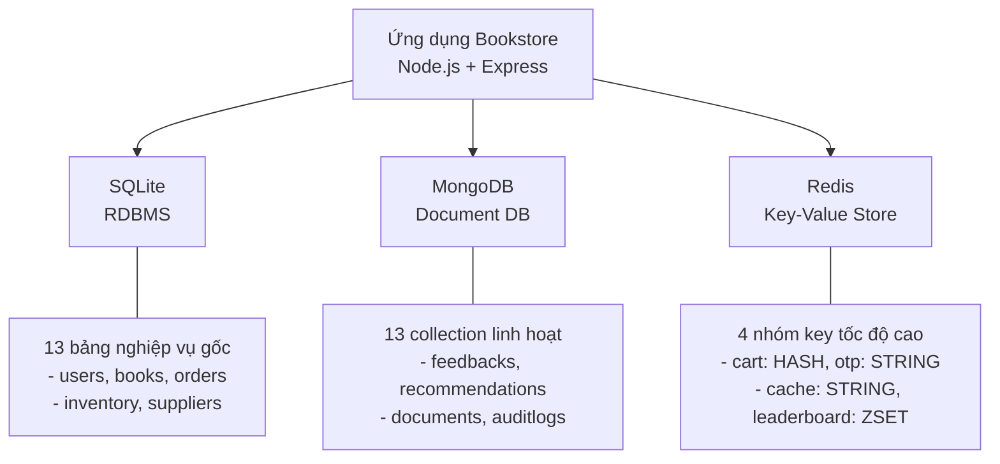
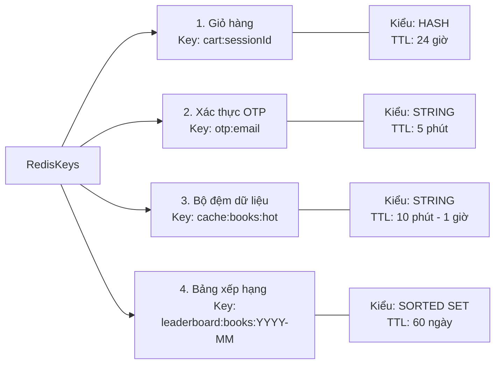
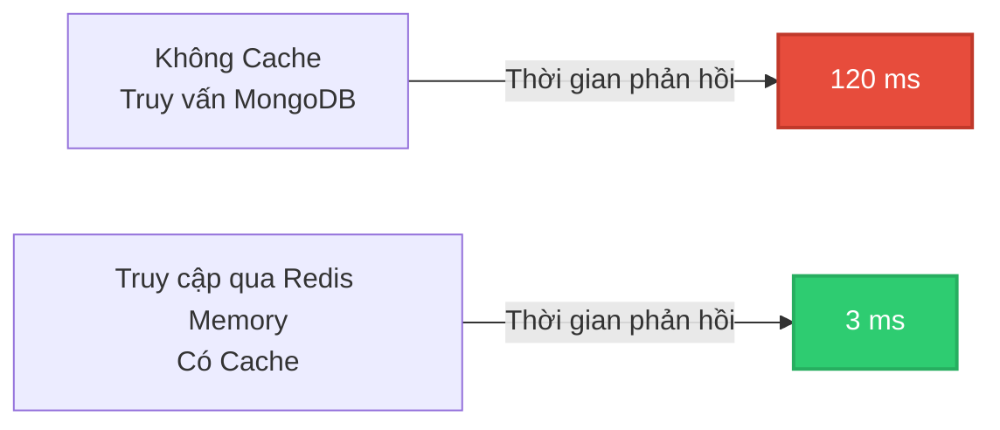

# BÁO CÁO ĐỀ ÁN CUỐI KỲ

**BỘ CÔNG THƯƠNG**
**TRƯỜNG ĐẠI HỌC CÔNG THƯƠNG THÀNH PHỐ HỒ CHÍ MINH**
**KHOA CÔNG NGHỆ THÔNG TIN**

---

**Môn học:** Dữ liệu NoSQL

**Giảng viên hướng dẫn:** Ngô Minh Anh Thư

**Tên đề tài:** Quản trị dữ liệu phi cấu trúc nhà sách

**Sinh viên thực hiện:** Nguyễn Thái Hòa (STT 6)
**MSSV:** 2001230252

*Thành phố Hồ Chí Minh, Năm 2026*

---

## MỤC LỤC

- [LỜI MỞ ĐẦU](#lời-mở-đầu)
- [CHƯƠNG I: TỔNG QUAN ĐỀ TÀI](#chương-i-tổng-quan-đề-tài)
  - [1.1. Lý do chọn đề tài](#11-lý-do-chọn-đề-tài)
  - [1.2. Mục tiêu đề tài](#12-mục-tiêu-đề-tài)
  - [1.3. Đối tượng và phạm vi nghiên cứu](#13-đối-tượng-và-phạm-vi-nghiên-cứu)
  - [1.4. Phương pháp thực hiện](#14-phương-pháp-thực-hiện)
- [CHƯƠNG II: CƠ SỞ LÝ THUYẾT](#chương-ii-cơ-sở-lý-thuyết)
  - [2.1. Tổng quan về hệ cơ sở dữ liệu NoSQL](#21-tổng-quan-về-hệ-cơ-sở-dữ-liệu-nosql)
  - [2.2. MongoDB - Cơ sở dữ liệu dạng Document](#22-mongodb---cơ-sở-dữ-liệu-dạng-document)
  - [2.3. Redis - Cơ sở dữ liệu dạng Key-Value](#23-redis---cơ-sở-dữ-liệu-dạng-key-value)
  - [2.4. Kiến trúc đa cơ sở dữ liệu trong ứng dụng web](#24-kiến-trúc-đa-cơ-sở-dữ-liệu-trong-ứng-dụng-web)
- [CHƯƠNG III: PHÂN TÍCH VÀ THIẾT KẾ HỆ THỐNG](#chương-iii-phân-tích-và-thiết-kế-hệ-thống)
  - [3.1. Phân tích hiện trạng ứng dụng Bookstore MVP](#31-phân-tích-hiện-trạng-ứng-dụng-bookstore-mvp)
  - [3.2. Thiết kế kiến trúc hệ thống đa cơ sở dữ liệu](#32-thiết-kế-kiến-trúc-hệ-thống-đa-cơ-sở-dữ-liệu)
  - [3.3. Thiết kế MongoDB - Collection feedbacks và bookRecommendations](#33-thiết-kế-mongodb---collection-feedbacks-và-bookrecommendations)
  - [3.4. Thiết kế Redis - Các nhóm Key-Value](#34-thiết-kế-redis---các-nhóm-key-value)
  - [3.5. So sánh cú pháp truy vấn giữa các hệ CSDL](#35-so-sánh-cú-pháp-truy-vấn-giữa-các-hệ-csdl)
- [CHƯƠNG IV: HIỆN THỰC HÓA VÀ KẾT QUẢ](#chương-iv-hiện-thực-hóa-và-kết-quả)
  - [4.1. Môi trường và công nghệ sử dụng](#41-môi-trường-và-công-nghệ-sử-dụng)
  - [4.2. Hiện thực hóa tích hợp MongoDB](#42-hiện-thực-hóa-tích-hợp-mongodb)
  - [4.3. Hiện thực hóa tích hợp Redis](#43-hiện-thực-hóa-tích-hợp-redis)
  - [4.4. Kết quả kiểm thử](#44-kết-quả-kiểm-thử)
- [CHƯƠNG V: KẾT LUẬN VÀ HƯỚNG PHÁT TRIỂN](#chương-v-kết-luận-và-hướng-phát-triển)
  - [5.1. Kết quả đạt được](#51-kết-quả-đạt-được)
  - [5.2. Hạn chế](#52-hạn-chế)
  - [5.3. Hướng phát triển](#53-hướng-phát-triển)
- [TÀI LIỆU THAM KHẢO](#tài-liệu-tham-khảo)
- [PHỤ LỤC: BÁO CÁO PHÂN CÔNG CÔNG VIỆC VÀ ĐÁNH GIÁ ĐÓNG GÓP](#phụ-lục-báo-cáo-phân-công-công-việc-và-đánh-giá-đóng-góp)

---

## LỜI MỞ ĐẦU

Trong bối cảnh chuyển đổi số diễn ra mạnh mẽ ở mọi lĩnh vực kinh doanh, các ứng dụng web hiện đại không còn đáp ứng được nhu cầu nếu chỉ dựa vào một hệ quản trị cơ sở dữ liệu quan hệ truyền thống. Mỗi bài toán nghiệp vụ khác nhau đòi hỏi một giải pháp lưu trữ phù hợp với đặc tính dữ liệu của nó.

Nhà sách là một môi trường kinh doanh điển hình có nhiều luồng dữ liệu đa dạng song song tồn tại. Dữ liệu nghiệp vụ truyền thống như thông tin sách, đơn hàng, tồn kho phù hợp với hệ quan hệ. Nhưng các luồng dữ liệu mới như đánh giá sản phẩm từ khách hàng với cấu trúc thay đổi linh hoạt, giỏ hàng tạm thời cần phản hồi nhanh tính bằng mili-giây, mã xác thực OTP có thời hạn ngắn hay bảng xếp hạng sách bán chạy cập nhật theo thời gian thực lại không phù hợp nếu lưu trong hệ quan hệ thông thường.

Báo cáo này trình bày giải pháp quản trị dữ liệu phi cấu trúc và bán cấu trúc trong hệ thống quản lý nhà sách. Dựa trên nền tảng lưu trữ quan hệ sẵn có, đề tài triển khai tích hợp các công nghệ NoSQL gồm MongoDB và Redis nhằm giải quyết tối ưu các bài toán nghiệp vụ đặc thù. Qua đó, em vận dụng và minh họa rõ nét vai trò riêng biệt của từng loại cơ sở dữ liệu trong một kiến trúc hệ thống thực tế.

---

## CHƯƠNG I: TỔNG QUAN ĐỀ TÀI

### 1.1. Lý do chọn đề tài

Trong quản lý nhà sách hiện đại, bên cạnh các dữ liệu có cấu trúc chặt chẽ như thông tin sách hay hóa đơn, lượng dữ liệu phi cấu trúc (như phản hồi của khách hàng, gợi ý mua sắm mua kèm, giỏ hàng tạm thời và phiên xác thực ngắn hạn) ngày càng lớn và thay đổi liên tục. Hệ cơ sở dữ liệu quan hệ truyền thống gặp nhiều hạn chế trong việc quản lý và tối ưu hiệu năng đối với các thành phần dữ liệu phi cấu trúc này.

Em lựa chọn đề tài "Quản trị dữ liệu phi cấu trúc nhà sách" dựa trên các lý do sau:
- Tận dụng hệ thống Bookstore sẵn có để tích hợp thêm các giải pháp quản lý dữ liệu phi cấu trúc chuyên biệt.
- MongoDB được ứng dụng để xử lý dữ liệu bán cấu trúc phong phú của hệ thống phản hồi (feedbacks) và cơ chế đề xuất sách liên quan (book recommendations).
- Redis được sử dụng nhằm tăng tốc độ xử lý các dữ liệu tạm thời như giỏ hàng trực tuyến, phiên xác thực OTP và bảng xếp hạng theo thời gian thực.
- Việc kết hợp nhiều công nghệ cơ sở dữ liệu giúp giải quyết trọn vẹn và tối ưu nhất cho từng loại dữ liệu đặc thù.

### 1.2. Mục tiêu đề tài

Đề tài hướng tới hoàn thành các mục tiêu sau:

- Hiểu rõ đặc điểm, mô hình dữ liệu và trường hợp sử dụng phù hợp của từng loại hệ cơ sở dữ liệu NoSQL bao gồm Document Database và Key-Value Store.
- Thiết kế và tích hợp Redis vào ứng dụng Bookstore với bốn nhóm key rõ ràng: giỏ hàng tạm, OTP đăng nhập, cache dữ liệu và leaderboard bán chạy.
- Bổ sung và hoàn thiện hai collection mới trong MongoDB là feedbacks và bookRecommendations với đầy đủ các thao tác CRUD, lọc điều kiện và thống kê bằng Aggregation Pipeline.
- Viết scripts thiết lập dữ liệu mẫu riêng biệt cho từng hệ cơ sở dữ liệu NoSQL.
- Lập tài liệu đặc tả yêu cầu và thiết kế hệ thống theo chuẩn học thuật.

### 1.3. Đối tượng và phạm vi nghiên cứu

**Đối tượng nghiên cứu:**

- Hệ cơ sở dữ liệu MongoDB với mô hình dữ liệu Document.
- Hệ cơ sở dữ liệu Redis với các cấu trúc dữ liệu HASH, STRING và Sorted Set.
- Kiến trúc đa cơ sở dữ liệu trong ứng dụng Node.js.

**Phạm vi nghiên cứu:**

- Ứng dụng Bookstore MVP triển khai cho mô hình nhà sách vừa và nhỏ.
- Tích hợp giới hạn trong phạm vi hai hệ NoSQL: MongoDB và Redis.
- Không thay thế SQLite là RDBMS gốc mà mở rộng thêm chức năng mới.

### 1.4. Phương pháp thực hiện

- Nghiên cứu tài liệu kỹ thuật chính thức của MongoDB và Redis.
- Phân tích hiện trạng ứng dụng để xác định điểm phù hợp tích hợp từng hệ NoSQL.
- Lập trình trực tiếp, kiểm thử từng API endpoint và viết scripts seed dữ liệu mẫu.
- So sánh hiệu năng giữa phương án có cache Redis và không có cache để minh chứng lợi ích thực tế.

---

## CHƯƠNG II: CƠ SỞ LÝ THUYẾT

### 2.1. Tổng quan về hệ cơ sở dữ liệu NoSQL

#### 2.1.1. Định nghĩa và phân loại

NoSQL là tên gọi chỉ nhóm các hệ quản trị cơ sở dữ liệu không sử dụng mô hình quan hệ và ngôn ngữ SQL làm phương thức truy vấn chính. Tên NoSQL được hiểu là Not Only SQL, nghĩa là các hệ này không nhằm thay thế SQL mà bổ sung thêm khả năng xử lý các loại dữ liệu và bài toán mà SQL truyền thống không giải quyết tốt.

Bđn loại chính của NoSQL được phân theo mô hình dữ liệu lưu trữ:

**Bảng 2.1. Phân loại các hệ cơ sở dữ liệu NoSQL**

| Loại | Đại diện | Mô hình dữ liệu | Trường hợp sử dụng tiêu biểu |
| :--- | :--- | :--- | :--- |
| Document | MongoDB, CouchDB | JSON/BSON Document | Nổi dung linh hoạt, catalog sản phẩm, hồ sơ người dùng |
| Key-Value | Redis, DynamoDB | Cặp Khóa - Giá trị | Cache, session, queue, leaderboard |
| Column-family | Cassandra, HBase | Bảng cột rộng | Log lớn, dữ liệu chuỗi thời gian |
| Graph | Neo4j, ArangoDB | Đỉnh và Cạnh | Mạng xã hổi, gợi ý, phát hiện gian lận |

#### 2.1.2. So sánh NoSQL với RDBMS truyền thống

**Bảng 2.2. So sánh NoSQL và RDBMS truyền thống**

| Tiêu chí | RDBMS | NoSQL |
| :--- | :--- | :--- |
| Lược đồ dữ liệu | Cđ định, phải định nghĩa trước | Linh hoạt, thay đổi được |
| Mô hình dữ liệu | Bảng - Hàng - Cổt | Document, Key-Value, Graph... |
| Ngôn ngữ truy vấn | SQL chuẩn hóa | Riêng theo từng hệ |
| Mở rộng quy mô | Chủ yếu theo chiều dọc | Theo chiều ngang dễ dàng hơn |
| Tính nhất quán | ACID đầy đủ | BASE, tùy từng hệ |
| Phù hợp với | Giao dịch tài chính, dữ liệu cấu trúc chặt | Dữ liệu lớn, linh hoạt, cần tốc độ cao |

### 2.2. MongoDB - Cơ sở dữ liệu dạng Document

#### 2.2.1. Mô hình dữ liệu Document

MongoDB lưu trữ dữ liệu dưới dạng Document có định dạng BSON là phiên bản nhị phân của JSON. Mỗi Document là một đối tượng đổc lập có thể chứa các trường dữ liệu với kiểu khác nhau, kể cả mảng và document lồng nhau.

Các khái niệm cốt lõi:

- **Database**: Tương đương database trong SQL.
- **Collection**: Tương đương bảng trong SQL nhưng không có schema cố định.
- **Document**: Tương đương một hàng dữ liệu nhưng là đối tượng JSON linh hoạt.
- **Field**: Tương đương cột nhưng mỗi document có thể có tập field khác nhau.

Ví dụ một Document trong collection feedbacks của hệ thống:

```json
{
  "_id": 1,
  "bookId": 1,
  "bookTitle": "Mắt biếc",
  "customerName": "Trần Thị Mai",
  "rating": 5,
  "comment": "Sách hay, giao hàng nhanh, đóng gói cẩn thận",
  "tags": ["hay", "giao nhanh", "đóng gói tốt"],
  "sentiment": "positive",
  "score": 0.94,
  "isFeatured": true,
  "status": "approved",
  "createdAt": "2026-07-10T08:00:00Z"
}
```

*Hình 2.1. Ví dụ Document JSON trong MongoDB*

So với bảng reviews cũ trong SQLite chỉ có 5 trường cố định, Document trên có thể chứa thêm các trường như sentiment, score, tags mà không cần thay đổi cấu trúc bảng.

#### 2.2.2. Aggregation Pipeline trong MongoDB

Aggregation Pipeline là cơ chế xử lý và thống kê dữ liệu theo từng giai đoạn nối tiếp nhau. Mỗi giai đoạn nhận đầu vào là kết quả của giai đoạn trước và xuất ra tập dữ liệu đã biến đổi.

Ví dụ thống kê số lượng và điểm trung bình theo từng nhãn cảm xúc trong collection feedbacks:

```javascript
db.feedbacks.aggregate([
  { $group: {
      _id: "$sentiment",
      soLuong: { $sum: 1 },
      diemTrungBinh: { $avg: "$rating" }
  }},
  { $sort: { soLuong: -1 } }
])
```

Kết quả trả về dạng:

```json
[
  { "_id": "positive", "soLuong": 4, "diemTrungBinh": 4.75 },
  { "_id": "neutral",  "soLuong": 1, "diemTrungBinh": 3.0  },
  { "_id": "negative", "soLuong": 1, "diemTrungBinh": 2.0  }
]
```

*Hình 2.2. Kết quả Aggregation Pipeline*

#### 2.2.3. Index trong MongoDB

MongoDB hỗ trợ nhiều loại index giúp tăng tốc độ truy vấn. Trong đề tài này, em sử dụng:

- **Single field index**: Đánh index riêng cho trường bookId để tăng tốc tìm feedback theo sách.
- **Compound index**: Kết hợp isFeatured và createdAt để lấy danh sách nổi bật sắp xếp theo thời gian.
- **Text index**: Đánh index toàn văn trên trường title và description của collection books.
- **TTL index**: Thiết lập thời gian tự động xóa cho collection auditlogs sau 90 ngày.

### 2.3. Redis - Cơ sở dữ liệu dạng Key-Value

#### 2.3.1. Đặc điểm của Redis

Redis là hệ cơ sở dữ liệu lưu trữ dữ liệu trong bộ nhớ RAM, cho phép đọc và ghi dữ liệu với tốc độ cực cao thường dưới 1 mili-giây. Redis không chỉ là một cơ sở dữ liệu Key-Value đơn giản mà hỗ trợ nhiều cấu trúc dữ liệu phong phú.

Các cấu trúc dữ liệu chính trong Redis và ứng dụng trong đề tài:

**Bảng 2.3. Các cấu trúc dữ liệu Redis và ứng dụng**

| Cấu trúc | Lệnh cơ bản | Ứng dụng trong đề tài |
| :--- | :--- | :--- |
| STRING | SET, GET, DEL | Lưu mã OTP, giá trị cache JSON |
| HASH | HSET, HGET, HGETALL | Lưu giỏ hàng theo từng sản phẩm |
| SORTED SET | ZADD, ZINCRBY, ZREVRANGEBYSCORE | Leaderboard sách bán chạy |
| LIST | LPUSH, RPOP | Hàng đợi xử lý |

#### 2.3.2. Cơ chế TTL - Time To Live

TTL là cơ chế cho phép gắn thời gian hết hạn tự động cho mỗi key trong Redis. Khi hết thời gian, Redis tự động xóa key đó mà không cần can thiệp từ phía ứng dụng.

Cú pháp thiết lập TTL:

```bash
SET otp:mai@gmail.com 847291 EX 300
```

Lệnh trên lưu mã OTP 847291 cho địa chỉ email mai@gmail.com và tự động xóa sau 300 giây tức 5 phút.

TTL là tính năng không có sẵn trong RDBMS thông thường, buộc lập trình viên phải tự viết cron job để xóa dữ liệu cũ. Redis giải quyết bài toán này một cách tự nhiên và hiệu quả.

#### 2.3.3. Sorted Set và bài toán Leaderboard

Sorted Set là cấu trúc dữ liệu đặc biệt của Redis lưu trữ tập các phần tử, mỗi phần tử gắn với một điểm số. Redis tự động duy trì thứ tự sắp xếp theo điểm số.

Ví dụ xây dựng leaderboard sách bán chạy tháng 2026-07:

```bash
ZADD leaderboard:books:2026-07 142 "1:Mat biec"
ZADD leaderboard:books:2026-07 98  "2:Dac Nhan Tam"
ZADD leaderboard:books:2026-07 87  "3:Toi thay hoa vang"

ZINCRBY leaderboard:books:2026-07 5 "1:Mat biec"

ZREVRANGEBYSCORE leaderboard:books:2026-07 +inf -inf WITHSCORES LIMIT 0 10
```

*Hình 2.3. Ví dụ lệnh Redis ZADD cho Leaderboard*

*Hình 2.4. Ví dụ lệnh Redis SET với TTL*

Khi có đơn hàng mới, lệnh ZINCRBY cộng thêm điểm bán vào thành viên tương ứng. ZREVRANGEBYSCORE lấy top 10 theo thứ tự điểm giảm dần với độ phức tạp O log N.

### 2.4. Kiến trúc đa cơ sở dữ liệu trong ứng dụng web

#### 2.4.1. Nguyên tắc phân vai trò

Trong kiến trúc đa cơ sở dữ liệu, mỗi hệ phải có vai trò rõ ràng và không chồng lắp. Nguyên tắc cơ bản là chọn hệ cơ sở dữ liệu phù hợp nhất với đặc tính của từng loại dữ liệu ồ khái niệm này được Fowler và Sadalage gọi là *Polyglot Persistence*:

- Dữ liệu cần tính nhất quán cao và ràng buộc phức tạp: RDBMS.
- Dữ liệu có cấu trúc linh hoạt, thay đổi thường xuyên: Document Database.
- Dữ liệu cần tốc độ cực cao, có thời hạn hoặc cần sắp xếp liên tục: Key-Value Store.

#### 2.4.2. Xử lý lỗi và graceful degradation

Trong kiến trúc đa cơ sở dữ liệu, ứng dụng phải xử lý trường hợp một trong các hệ cơ sở dữ liệu tạm thời không khả dụng. Nguyên tắc graceful degradation yêu cầu ứng dụng vẫn hoạt động được với chức năng giảm bớt thay vÀ sập hoàn toàn.

Trong đề tài này, khi Redis không khả dụng, các API giỏ hàng và OTP trả về thông báo lỗi rõ ràng, trong khi toàn bộ các API nghiệp vụ chính như quản lý sách, đơn hàng và kho vẫn hoạt động bình thường thông qua MongoDB và SQLite.

---

## CHƯƠNG III: PHÂN TÍCH VÀ THIẾT KẾ HỆ THỐNG

### 3.1. Phân tích hiện trạng ứng dụng Bookstore MVP

#### 3.1.1. Cấu trúc hệ thống ban đầu

Bookstore MVP là ứng dụng quản lý nhà sách xây dựng bằng Node.js và Express. Cấu trúc dữ liệu ban đầu của ứng dụng sử dụng:

**SQLite làm RDBMS chính** với 13 bảng quan hệ:

**Bảng 3.1. Các bảng SQLite trong hệ thống Bookstore MVP**

| Bảng | Mô tả |
| :--- | :--- |
| users, roles, permissions, role_permissions | Quản lý người dùng và phân quyền RBAC |
| books, authors, categories, publishers | Danh mục sách |
| customers, orders, order_items | Khách hàng và đơn hàng bán lẻ |
| suppliers, inventory_slips, inventory_transactions | Nhà cung cấp và kho hàng |
| documents, document_metadata | Tài liệu phi cấu trúc |

**MongoDB đã có** với 11 collection mirror dữ liệu từ SQLite cùng các collection đặc thù:

**Bảng 3.2. Các collection MongoDB mirror và đặc thù**

| Collection | Vai trò |
| :--- | :--- |
| books, customers, orders, suppliers, documents... | Mirror dữ liệu nghiệp vụ từ SQLite |
| auditlogs | Log kiểm toán tự xóa sau 90 ngày theo TTL index |
| systemlogs | Log hệ thống có cấu trúc |
| feedbacks | Schema cũ, chỉ có 5 trường, chưa có CRUD đầy đủ |

#### 3.1.2. Định hướng quản trị dữ liệu phi cấu trúc

Dựa trên phân tích hiện trạng, việc nâng cao năng lực quản trị dữ liệu phi cấu trúc và bán cấu trúc được định hướng tập trung vào hai nội dung chính:

**Quản trị tài liệu và gợi ý trên MongoDB:**
- Thiết kế lại collection `feedbacks` với cấu trúc tài liệu mở rộng, hỗ trợ lưu trữ các trường động như kết quả phân tích cảm xúc của mô hình trí tuệ nhân tạo (sentiment, score) và các thẻ phân loại phản hồi (tags).
- Bổ sung collection `bookRecommendations` hoàn toàn mới để tối ưu hóa việc phân cấp dữ liệu gợi ý và danh sách sách mua kèm thường xuyên.

**Quản lý dữ liệu hiệu năng cao và có thời hạn trên Redis:**
- Nhóm key giỏ hàng tạm thời (cart) nhằm cải thiện độ trễ.
- Nhóm key xác thực một lần (OTP) hỗ trợ đăng nhập nhanh.
- Nhóm key bộ đệm (cache) nhằm giảm tải cho cơ sở dữ liệu nền.
- Nhóm key bảng xếp hạng (leaderboard) cập nhật theo thời gian thực.

### 3.2. Thiết kế kiến trúc hệ thống đa cơ sở dữ liệu

Hệ thống vận hành theo kiến trúc ba tầng cơ sở dữ liệu:



*Hình 3.1. Sơ đồ kiến trúc hệ thống ba tầng cơ sở dữ liệu*

**Phân vai trò rõ ràng:**

**Bảng 3.3. Phân vai trò giữa ba hệ cơ sở dữ liệu**

| Hệ CSDL | Dữ liệu quản lý | Lý do chọn |
| :--- | :--- | :--- |
| SQLite | Toàn bộ nghiệp vụ gốc: users, books, orders, inventory | ACID đầy đủ, ràng buộc khóa ngoại, đã hoàn chỉnh |
| MongoDB | Dữ liệu linh hoạt: feedbacks, recommendations, documents, logs | Schema-less phù hợp dữ liệu có cấu trúc thay đổi, hỗ trợ aggregation mạnh |
| Redis | Dữ liệu tốc độ cao: cart, OTP, cache, leaderboard | In-memory, TTL tự nhiên, Sorted Set cho leaderboard |

### 3.3. Thiết kế MongoDB - Collection feedbacks và bookRecommendations

#### 3.3.1. Collection feedbacks

**Mục đích và Vai trò:**
Hệ thống cần quản lý thông tin đánh giá feedback của khách hàng về sách. Do mỗi lượt đánh giá có thể chứa các thông tin không  nhất (ví dụ: các nhãn thẻ phản hồi khác nhau, kết quả phân tích cảm xúc từ AI với độ tin cậy biến động), mô hình bán cấu trúc của MongoDB là lựa chọn tối ưu. Hệ cơ sở dữ liệu Document này giúp lưu trữ linh hoạt mà không cần khai báo schema cứng nhắc như trong RDBMS truyền thống.

**Đặc tả lược đồ Schema thiết kế:**
Lược đồ feedback được thiết kế chi tiết bao gồm các thông tin liên kết nghiệp vụ với SQLite như `bookId`, `customerId` và các thuộc tính khai phá dữ liệu tự động `sentiment`, `score`, `tags`:

```json
{
  "bookId": Number,
  "bookTitle": "String",
  "customerId": Number,
  "customerName": "String",
  "email": "String",
  "rating": Number,
  "comment": "String",
  "tags": ["String"],
  "sentiment": "positive | negative | neutral",
  "score": Number,
  "isFeatured": Boolean,
  "status": "new | reviewed | resolved | urgent",
  "createdAt": Date,
  "media": [{
    "fileName": "String",
    "fileType": "String",
    "fileSizeKB": Number,
    "fileData": "BinData"
  }]
}
```

*Hình 3.2. Dữ liệu collection feedbacks trong MongoDB Compass (ảnh chụp màn hình)*

**Thiết kế hệ thống chỉ mục Indexes:**
Để tối ưu hóa hiệu năng truy vấn cho các nghiệp vụ hiển thị và quản lý, hệ thống cấu hình các chỉ mục sau:
1. Ch0 mục phức hợp `{ bookId: 1, createdAt: -1 }`: Hỗ trợ tìm kiếm nhanh các đánh giá của từng cuốn sách cụ thể, sắp xếp theo thời gian gửi mới nhất.
2. Ch0 mục phức hợp `{ sentiment: 1, rating: -1 }`: Tối ưu cho chức năng lọc đánh giá theo cảm xúc (ví dụ: chỉ hiện đánh giá tiêu cực để xử lý khẩn cấp).
3. Ch0 mục `{ createdAt: 1 }` với thuộc tính `expireAfterSeconds: 63072000` TTL 2 năm: Tự động dọn dẹp các đánh giá quá cũ nhằm giải phóng dung lượng đĩa cứng một cách tự động.

**Dữ liệu mẫu thực tế:**
Dưới đây là một tài liệu document mẫu mô tả đánh giá tích cực đã qua duyệt của khách hàng:

```json
{
  "_id": 1,
  "bookId": 1,
  "sentiment": "positive",
  "score": 0.94,
  "isFeatured": true,
  "status": "new",
  "createdAt": "2026-07-10T08:00:00Z"
}
```

**Câu lệnh truy vấn tiêu biểu:**

Lấy danh sách feedback đã duyệt của một cuốn sách, ưu tiên nổi bật:

```javascript
db.feedbacks.find(
  {},
  { media: 0 }
).sort({ isFeatured: -1, createdAt: -1 }).limit(10)
```

*Hình 2.5. Ví dụ Aggregation Pipeline MongoDB*

Thống kê phân bố cảm xúc:

```javascript
db.feedbacks.aggregate([
  { $group: {
      _id: "$sentiment",
      soLuong: { $sum: 1 },
      diemTrungBinh: { $avg: "$rating" }
  }},
  { $sort: { soLuong: -1 } }
])
```

Top 5 sách có nhiều đánh giá nhất:

```javascript
db.feedbacks.aggregate([
      soLuongDanhGia: { $sum: 1 },
      diemTB: { $avg: "$rating" }
  }},
  { $sort: { soLuongDanhGia: -1 } },
  { $limit: 5 }
])
```

#### 3.3.2. Collection bookRecommendations

**Mục đích và Vai trò:**
Bên cạnh phân hệ nhận xét của người dùng, việc gợi ý các sản phẩm liên quan đóng vai trò quan trọng trong việc kích cầu tiêu dùng. Để lưu trữ các danh mục gợi ý như sách cùng thể loại, sách cùng tác giả và danh sách các sản phẩm thường được mua kèm vđn có kích thước động và cấu trúc thay đổi tùy theo thuật toán khai phá dữ liệu, collection `bookrecommendations` được thiết kế. Lược đồ document này cho phép lưu trữ cấu trúc phân cấp linh hoạt, giúp ứng dụng lấy toàn bộ dữ liệu gợi ý chỉ bằng một truy vấn duy nhất.

**Đặc tả lược đồ Schema thiết kế:**
Mỗi tài liệu trong collection lưu trữ khóa ngoại `bookId` liên kết với SQLite cùng hai mảng dữ liệu phục vụ gợi ý:

```json
{
    {
      "bookId": Number,
      "bookTitle": "String",
      "score": Number,
      "reason": "String"
    }
  ],
  "frequentlyBoughtTogether": [Number],
  "updatedAt": Date
}
```

**Dữ liệu mẫu thực tế:**
Dưới đây là một ví dụ tài liệu gợi ý cho sách "Mắt biếc" liên kết với các tác phẩm cùng thể loại hoặc cùng tác giả Nguyễn Nhật Ánh:

```json
{
  "bookId": 1,
    {
      "bookId": 4,
      "bookTitle": "Dế Mèn Phiêu Lưu Ký",
      "score": 0.72,
      "reason": "Cùng thể loại Văn học thiếu nhi Việt Nam"
    }
  ],
  "frequentlyBoughtTogether": [3, 2, 5],
  "updatedAt": "2026-07-15T00:00:00Z"
}
```

**Câu lệnh truy vấn tiêu biểu:**
Trong quá trình kết xuất giao diện chi tiết sách, ứng dụng thực hiện tìm tài liệu gợi ý, sau đó sử dụng mảng mã sách mua kèm để thực hiện phép chiếu thông tin chi tiết từ bảng SQLite tương ứng:

```javascript
const rec = await BookRecommendation.findOne({ bookId: 1 });
const togetherBooks = await Book.find({
  _id: { $in: rec.frequentlyBoughtTogether }
}).select("_id title author salePrice stockQuantity");
```

---

### 3.4. Thiết kế Redis - Các nhóm Key-Value

Để đáp ứng yêu cầu phi chức năng về tốc độ phản hồi tối ưu dưới 10 mili-giây và quản lý hiệu quả các dữ liệu có thời hạn, hệ thống tích hợp Redis làm cơ sở dữ liệu Key-Value Store chạy song song. Dưới đây là thiết kế chi tiết cho 4 nhóm key nghiệp vụ chính được tích hợp trong ứng dụng:

#### 3.4.1. Nhóm key 1 - Giỏ hàng tạm

**Mô tả bài toán nghiệp vụ:**
Khách duyệt web cần thêm sách vào giỏ hàng trước khi tiến hành đặt hàng chính thức. Giỏ hàng tạm thời này cần tồn tại xuyên suốt phiên duyệt web của người dùng dù chưa đăng nhập và phải tự động giải phóng khỏi hệ thống nếu khách hàng không quay lại sau 24 giờ nhằm tránh tích tụ rác dữ liệu.

**Giải pháp kỹ thuật sử dụng Redis HASH:**
Thay vÀ lưu trữ dữ liệu giỏ dưới dạng chuỗi JSON STRING yêu cầu phải đọc ra, tuần tự hóa lại mỗi khi thay đổi số lượng, thiết kế sử dụng cấu trúc dữ liệu `HASH` của Redis. Cấu trúc này cho phép cập nhật trực tiếp từng trường dữ liệu con field riêng lẻ (ví dụ: thay đổi số lượng bằng `HSET`, xóa sản phẩm bằng `HDEL`) với độ phức tạp thuật toán tối ưu $O(1)$ mà không ảnh hưởng đến các phần tử khác trong giỏ.

**Thiết kế Key Schema:**

```
Key:    cart:{sessionId}
Type:   HASH
TTL:    86400 giây (24 giờ)

*Các trường dữ liệu trong Hash:*
- `{bookId}:qty`: Số lượng sách.
- `{bookId}:price`: Đơn giá tại thời điểm thêm vào giỏ.
- `{bookId}:title`: Tiêu đề sách.
- `{bookId}:cover`: Liên kết ảnh bìa.
```

**Ví dụ thực tế:**

```bash
HSET cart:abc-session-001 "1:qty" "2" "1:price" "88000" "1:title" "Mat biec" "3:qty" "1" "3:price" "72000" "3:title" "Toi thay hoa vang"
EXPIRE cart:abc-session-001 86400
HGET   cart:abc-session-001 1:qty
HDEL   cart:abc-session-001 3:qty 3:price 3:title 3:cover
```
*Hình 3.3. Ví dụ thao tác Redis HASH với giỏ hàng*

**Luồng checkout:**

1. Lấy toàn bộ giỏ hàng bằng HGETALL.
2. Tạo đơn hàng mới trong MongoDB.
3. Cổng điểm bán vào Leaderboard Sorted Set.
4. Xóa giỏ hàng bằng DEL.
5. Xóa cache doanh thu đang lỗi thời bằng DEL cache:stats:*.

#### 3.4.2. Nhóm key 2 - OTP đăng nhập

**Mô tả bài toán nghiệp vụ:**
Để tạo trải nghiệm đặt hàng trực tuyến thuận tiện cho khách hàng vãng lai mà không bắt buộc họ phải đăng ký tài khoản phức tạp, hệ thống thiết kế cơ chế đăng nhập nhanh bằng mã OTP gửi qua email. Mã này đòi hỏi độ bảo mật cao, thời gian tồn tại rất ngắn và có cơ chế giới hạn tần suất gửi cooldown để chđng spam.

**Giải pháp kỹ thuật sử dụng Redis STRING:**
Mã xác thực OTP là thông tin có cấu trúc đơn giản nhưng yêu cầu tự động hết hạn nghiêm ngặt. Giải pháp dựa trên cấu trúc `STRING` của Redis được triển khai nhằm thực hiện ghi giá trị OTP và thiết lập thời gian sống TTL 5 phút trong một thao tác duy nhất. Đồng thời, một key cooldown phụ có thời hạn 60 giây được tạo để ngăn chặn việc gửi yêu cầu OTP liên tiếp.

**Thiết kế Key Schema:**

```
Key:    otp:{email}
Type:   STRING
Value:  6 chữ số ngẫu nhiên
TTL:    300 giây (5 phút)

Key:    otp_cd:{email}
Type:   STRING
Value:  "1"
TTL:    60 giây (cooldown 1 phút)
```

**Ví dụ thực tế:**

```bash
SET otp:mai@gmail.com 847291 EX 300
```

**Luồng xác thực OTP:**
Khi khách hàng gửi yêu cầu đăng nhập, hệ thống sẽ:
1. Kiểm tra sự tồn tại của key `otp_cd:{email}`. Nếu tồn tại, hệ thống trả về mã lỗi `429 Too Many Requests` yêu cầu người dùng chờ đợi.
2. Nếu không b9 cooldown, hệ thống sinh ngẫu nhiên mã số gồm 6 chữ số và lưu vào Redis với TTL là 5 phút.
3. Khi khách hàng nhập mã OTP để xác nhận, hệ thống đọc từ Redis và so sánh. Nếu trùng khớp, hệ thống ngay lập tức xóa key OTP để tránh tấn công phát lại và phát hành một JWT token có thời hạn 2 giờ để khách hàng thực hiện đặt hàng.

#### 3.4.3. Nhóm key 3 - Cache dữ liệu

**Mô tả bài toán nghiệp vụ:**
Các truy vấn danh sách sách hot, kết quả tìm kiếm từ khóa và thống kê doanh thu được gọi liên tục từ phía khách hàng. Nếu mỗi yêu cầu đều truy cập trực tiếp vào MongoDB/SQLite sẽ làm tăng độ trễ phản hồi trung bình 80-150 mili-giây và gây lãng phí tài nguyên CPU của máy chủ cơ sở dữ liệu.

**Giải pháp kỹ thuật sử dụng Redis STRING và Chiến lược Cache-Aside:**
Chiến lược lưu đệm đằng sau được áp dụng. Toàn bộ mảng kết quả dưới dạng đối tượng JSON sẽ được tuần tự hóa thành chuỗi và lưu vào Redis dưới dạng một key `STRING`. Khi có yêu cầu, hệ thống sẽ kiểm tra Redis trước: nếu có dữ liệu Cache Hit, kết quả sẽ được trả về ngay lập tức; nếu không có Cache Miss, hệ thống mới truy vấn MongoDB, sau đó ghi kết quả ngược lại vào Redis kèm TTL tương ứng.

**Thiết kế các khóa Keys của bộ đệm:**

**Bảng 3.6. Thiết kế các khóa cache Redis**

| Tên khóa (Key) | Thời gian sống (TTL) | Vai trò lưu trữ |
| :--- | :--- | :--- |
| `cache:books:hot` | 3600 giây (1 giờ) | Danh sách các đầu sách nổi bật hiển thị trên trang chủ |
| `cache:search:{query}` | 300 giây (5 phút) | Kết quả tìm kiếm theo từ khóa của khách hàng |
| `cache:book:{id}` | 600 giây (10 phút) | Chi tiết thông tin và nội dung của một cuốn sách |
| `cache:stats:revenue` | 1800 giây (30 phút) | Kết quả thống kê báo cáo doanh thu định kỳ |

**Pattern Cache-aside trong code:**

```javascript
async function getHotBooks(req, res) {

  const cached = await redis.get(key);
  if (cached) {
    return res.json({ source: "redis_cache", data: JSON.parse(cached) });
  }

  const books = await Book.find({ stockQuantity: { $gt: 0 } })
    .sort({ updatedAt: -1 }).limit(10).lean();

  await redis.set(key, JSON.stringify(books), "EX", 3600);

  return res.json({ source: "mongodb", data: books });
}
```

*Hình 3.4. Ví dụ lệnh Redis SET OTP*

*Lưu ý:* Việc đính kèm thuộc tính `source` trong phản hồi nhằm giúp dễ dàng xác minh nguồn dữ liệu từ cache hay từ database gốc trong quá trình vận hành và kiểm thử hiệu năng.

#### 3.4.4. Nhóm key 4 - Leaderboard sách bán chạy

**Mô tả bài toán nghiệp vụ:**
Trang chủ ứng dụng cần hiển thị bảng xếp hạng Top 10 cuốn sách bán chạy nhất theo từng tháng. Yêu cầu đặt ra là điểm số và thứ hạng của sách phải được cập nhật ngay lập tức theo thời gian thực mỗi khi có đơn hàng được thanh toán thành công, thay vÀ phải chạy các câu lệnh thống kê `Group By` nặng nề trên toàn bộ lịch sử đơn hàng.

**Giải pháp kỹ thuật sử dụng Redis Sorted Set (ZSET):**
Redis Sorted Set là cấu trúc dữ liệu lưu trữ tập hợp các thành viên không trùng lặp, trong đó mỗi thành viên đi kèm với một điểm số. Redis tự động duy trì thứ tự sắp xếp của các phần tử theo điểm số này. Khi có đơn hàng mới, hệ thống chỉ cần gọi lệnh `ZINCRBY` để cộng thêm số lượng bán vào thành viên tương ứng với độ phức tạp thời gian chỉ $O(\log N)$, và lấy ra Top 10 cực kỳ nhanh chóng bằng lệnh `ZREVRANGEBYSCORE`.

**Thiết kế key schema:**

```

Key:    leaderboard:books:{YYYY-MM}
Type:   SORTED SET
Score:  Tổng số lượng đã bán
Member: "{bookId}:{tenSach}"
TTL:    5184000 giây (60 ngày)
```

**Ví dụ thực tế:**

```bash
ZADD leaderboard:books:2026-07 142 "1:Mat biec"
ZADD leaderboard:books:2026-07 98  "2:Dac Nhan Tam"
```



*Hình 3.5. Sơ đồ bốn nhóm key Redis với cấu trúc và TTL tương ứng*

### 3.5. So sánh cú pháp truy vấn giữa các hệ CSDL

**Bảng 3.4. So sánh cú pháp thao tác cơ bản giữa SQL, MongoDB và Redis**

| Thao tác | SQL - SQLite | MongoDB | Redis |
| :--- | :--- | :--- | :--- |
| Lấy tất cả | `SELECT * FROM books` | `db.books.find({})` | `KEYS pattern*` |
| Lọc điều kiện | `SELECT * FROM books WHERE category='Văn học'` | `db.books.find({category:'Văn học'})` | `HSCAN key` |
| Thêm mới | `INSERT INTO books VALUES (...)` | `db.books.insertOne({...})` | `SET key value` |
| Cập nhật | `UPDATE books SET price=90000 WHERE id=1` | `db.books.updateOne({_id:1},{$set:{price:90000}})` | `HSET key field value` |
| Xóa | `DELETE FROM books WHERE id=1` | `db.books.deleteOne({_id:1})` | `DEL key` |
| Đếm | `SELECT COUNT(*) FROM books` | `db.books.countDocuments({})` | `DBSIZE` |
| Sắp xếp | `ORDER BY price DESC` | `.sort({price:-1})` | `ZREVRANGEBYSCORE` |
| Giới hạn | `LIMIT 10` | `.limit(10)` | `LIMIT 0 10` |
| Thống kê | `SELECT SUM(total) FROM orders` | `db.orders.aggregate([{$group:{_id:null,total:{$sum:'$total'}}}])` | `ZSCORE key member` |
| Hết hạn tự động | Không có | TTL index | `EXPIRE key seconds` |

**Bảng 3.5. So sánh đặc tính phù hợp của từng hệ CSDL trong đề tài**

| Tiêu chí | SQLite | MongoDB | Redis |
| :--- | :---: | :---: | :---: |
| Giao dịch ACID | Tốt | Có | Hạn chế |
| Schema linh hoạt | Không | Có | Có |
| Tốc độ đọc/ghi | Tốt | Tốt | Rất cao |
| TTL tự nhiên | Không | TTL index | Có |
| Tìm kiếm toàn văn | FTS5 | Text index | Không |
| Leaderboard | Cần tính toán | Cần aggregation | Tự nhiên bằng ZSET |
| Thích hợp cho đề tài | Nghiệp vụ gốc | Feedback, Docs, Log | Cart, OTP, Cache |

---

## CHƯƠNG IV: HIỆN THỰC HÓA VÀ KẾT QUẢ

### 4.1. Môi trường và công nghệ sử dụng

**Môi trường phát triển:**

**Bảng 4.1. Môi trường phát triển và công nghệ**

| Thành phần | Công nghệ | Phiên bản |
| :--- | :--- | :--- |
| Runtime | Node.js | 20.x LTS |
| Framework | Express | 5.x |
| RDBMS | SQLite via better-sqlite3 | 12.x |
| MongoDB Driver | Mongoose | 9.x |
| Redis Driver | ioredis | 5.x |
| MongoDB Server | MongoDB | Local |
| Redis Server | Redis | 7.x (Docker local) |

### 4.2. Hiện thực hóa tích hợp MongoDB

Phân hệ tích hợp MongoDB trong ứng dụng Bookstore được triển khai sử dụng thư viện Mongoose nhằm thiết lập các Schema và tương tác với cơ sở dữ liệu Document. Quá trình hiện thực hóa tập trung vào hai tính năng chính là lưu trữ thông tin Feedback của khách hàng và đưa ra các đề xuất sách liên quan.

#### 4.2.1. Schema Mongoose cho Feedback

Lược đồ dữ liệu của Feedback được ánh xạ trực tiếp từ thiết kế logic ở Chương III sang code Mongoose Schema. Lược đồ này định nghĩa các trường dữ liệu, ràng buộc kiểu dữ liệu,  thời chỉ định các chỉ mục indexes để tăng hiệu năng tìm kiếm:

```javascript
const feedbackSchema = new mongoose.Schema({
  bookId:       Number,
  bookTitle:    String,
  customerName: { type: String, required: true },
  email:        String,
  rating:       { type: Number, min: 1, max: 5, required: true },
  comment:      { type: String, required: true },
  tags:         [String],
  sentiment:    { type: String, enum: ["positive","negative","neutral"] },
  score:        { type: Number, default: 0.5 },
  isFeatured:   { type: Boolean, default: false },
  status:       { type: String, enum: ["new", "reviewed", "resolved", "urgent"], default: "new" },
  createdAt:    { type: Date, default: Date.now },
  media: [{
    fileName: String,
    fileType: String,
    fileSizeKB: Number,
    fileData: Buffer
  }]
});
feedbackSchema.index({ createdAt: 1 }, { expireAfterSeconds: 730 * 24 * 60 * 60 });
feedbackSchema.index({ bookId: 1, createdAt: -1 });
feedbackSchema.index({ sentiment: 1, rating: -1 });
feedbackSchema.index({ isFeatured: -1, createdAt: -1 });
```

*Hình 4.2. Mongoose Schema và cấu hình index của collection feedbacks*

#### 4.2.2. API Endpoints Feedback

Để cung cấp các dịch vụ thao tác dữ liệu MongoDB cho giao diện Frontend, hệ thống định nghĩa bộ các RESTful API endpoints cho đối tượng Feedback như mô tả trong bảng dưới đây:

| Method | Endpoint | Quyền | Chức năng |
| :--- | :--- | :--- | :--- |
| GET | /api/feedbacks | Admin | Danh sách có filter: sentiment, status, rating, bookId |
| GET | /api/feedbacks/stats | Admin | Thống kê aggregation: sentiment, rating, top books |
| GET | /api/feedbacks/book/:bookId | Public | Feedback theo sách, ưu tiên nổi bật |
| POST | /api/feedbacks | Public | Gửi đánh giá, gọi AI phân tích cảm xúc |
| PATCH | /api/feedbacks/:id/status | Admin | Cập nhật trạng thái |
| POST | /api/feedbacks/:id/feature | Admin | Toggle nổi bật/bỏ nổi bật |
| DELETE | /api/feedbacks/:id | Admin | Xóa đánh giá |

*Hình 4.3. Giao diện admin quản lý danh sách feedback với bổ lọc sentiment và trạng thái (ảnh chụp màn hình)*

#### 4.2.3. Tích hợp AI phân tích cảm xúc

Mổt điểm cải tiến quan trọng của hệ thống là việc tích hợp trí tuệ nhân tạo AI để phân tích cảm xúc từ nội dung nhận xét của khách hàng. Khi có yêu cầu gửi đánh giá mới `POST /api/feedbacks`, hệ thống sẽ tự động gọi hàm `analyzeFeedbackSentiment` từ module `ai-service.js`. Hàm này sử dụng mô hình ngôn ngữ lớn để trả về kết quả phân tích cảm xúc bao gồm nhãn cảm xúc `positive`, `negative`, `neutral` và điểm tin cậy confidence score trong khoảng từ 0 đến 1.

Dựa trên kết quả trả về của AI, hệ thống áp dụng các quy tắc tự động hóa nghiệp vụ sau:
* **Tự động làm nổi bật Auto-Feature**: Nếu cảm xúc là tích cực `positive`, điểm đánh giá từ 4 sao trở lên và điểm tin cậy $\ge 0.8$, đánh giá sẽ tự động được đặt thuộc tính `isFeatured = true` để hiển thị ưu tiên trên trang chủ.
* **Tự động gắn cờ khẩn cấp Urgent Flagging**: Nếu cảm xúc là tiêu cực `negative` và điểm đánh giá từ 2 sao trở xuống, hệ thống sẽ tự động chuyển trạng thái đánh giá thành `urgent` để thông báo cho ban quản trị k9p thời giải quyết khiếu nại.
* **Chế đổ dự phòng Graceful Degradation**: Trong trường hợp kết nối dịch vụ AI b9 gián đoạn, hệ thống tự động chuyển sang chế đổ dự phòng bằng cách sử dụng các quy tắc dựa trên điểm số `rating` (ví dụ: điểm $\ge 4$ mặc định là tích cực, điểm $\le 2$ mặc định là tiêu cực) để đảm bảo tính liên tục của hệ thống.

*Hình 4.4. Kết quả thống kê phân bố cảm xúc từ API /api/feedbacks/stats (ảnh chụp màn hình)*

### 4.3. Hiện thực hóa tích hợp Redis

Phân hệ tích hợp Redis trong ứng dụng Bookstore được hiện thực hóa qua các module dịch vụ trong thư mục `src/`. Để tăng cường tính chịu lỗi và tính sẵn sàng cao, kết nối Redis được thiết lập thông qua thư viện `ioredis` với các cấu hình tối ưu hóa tài nguyên như trì hoãn kết nối `lazyConnect` và chiến lược thử lại tự động `retryStrategy`:

#### 4.3.1. Kết nối Redis với xử lý lỗi

Module `redis-client.js` chịu trách nhiệm khởi tạo và quản lý vòng đời kết nối tới máy chủ Redis:

```javascript
const client = new Redis(REDIS_URL, {
  retryStrategy(times) {
    if (times > 3) return null;
    return Math.min(times * 500, 2000);
  },
  lazyConnect: true,
});
```

*Hình 4.7. Kết nối Redis với retry strategy*


Hàm `isRedisActive` được thiết kế để tự động kiểm tra trạng thái kết nối trước mỗi thao tác. Nếu Redis không hoạt động, hệ thống sẽ kích hoạt luồng xử lý lỗi tự động và trả về mã trạng thái `503 Service Unavailable` thay vÀ gây dừng đổt ngổt máy chủ Node.js.

#### 4.3.2. Cart Service

D9ch vụ giỏ hàng được triển khai trong tệp `cart-service.js` để thực hiện các thao tác trên cấu trúc HASH. Khi khách hàng thực hiện thêm một sản phẩm vào giỏ, hệ thống gọi hàm `addToCart` dưới đây để lưu trữ thông tin sản phẩm và gia hạn thời gian sống TTL:

```javascript
async function addToCart(sessionId, book, qty = 1) {
  const client = getClient();
  const key = `cart:${sessionId}`;
  const bookId = String(book.id);

  const currentQty = parseInt(await client.hget(key, `${bookId}:qty`) || "0");
  const newQty = currentQty + qty;

  const pipeline = client.pipeline();
  pipeline.hset(key,
    `${bookId}:qty`,   String(newQty),
    `${bookId}:price`, String(book.salePrice),
    `${bookId}:title`, book.title
  );
  pipeline.expire(key, 86400);
  await pipeline.exec();

  return getCart(sessionId);
}
```

*Hình 4.8. Hàm addToCart với Redis Pipeline*

Sử dụng pipeline để gom nhiều lệnh Redis vào một lần gọi mạng, giảm độ trễ.

#### 4.3.3. Leaderboard cập nhật khi có đơn hàng

Hàm `incrementLeaderboard` trong `cache-service.js` chịu trách nhiệm cập nhật điểm bán hàng vào bảng xếp hạng Redis sau mỗi giao dịch checkout thành công. Hàm này nhận vào danh sách các mặt hàng đã mua bao gồm `bookId`, `bookTitle` và `quantity` cùng tháng hiện tại dưới dạng chuỗi `YYYY-MM`. Toàn bộ lệnh `ZINCRBY` cho từng đầu sách được gom vào một Redis Pipeline duy nhất trước khi thực thi, nhằm giảm thiểu số lần gọi mạng xuống còn một lần duy nhất cho cả lô dữ liệu:

```javascript
async function incrementLeaderboard(items, month) {
  const pipeline = client.pipeline();
  for (const item of items) {
    const member = `${item.bookId}:${item.bookTitle}`;
    pipeline.zincrby(key, item.quantity, member);
  }
  pipeline.expire(key, 60 * 24 * 3600);
  await pipeline.exec();
}
```

*Hình 4.9. Hàm incrementLeaderboard với Redis Pipeline*

Sau khi thực thi, lệnh `EXPIRE` gia hạn thời gian sống của key Leaderboard thêm 60 ngày, đảm bảo dữ liệu không b9 mất trong suốt tháng và tự động được dọn dẹp sau đó. Nhờ tính chất tự sắp xếp của Sorted Set, thứ hạng mới của các cuốn sách được cập nhật ngay lập tức mà không cần thực hiện thêm bất kỳ thao tác sắp xếp nào.

#### 4.3.4. Kết quả seed dữ liệu mẫu Redis

Chạy lệnh `npm run setup:redis` để seed dữ liệu mẫu:

```

ởa Bắt đầu seed dữ liệu Redis...

✅ Kết nối Redis thành công: redis://127.0.0.1:6379

ở [1/4] Seed giỏ hàng mẫu (cart HASH)...
   ✅ cart:demo-session-001 ồ 2 sách, TTL=86400s
   ✅ cart:demo-session-002 ồ 2 sách, TTL=86400s

ở [2/4] Seed OTP mẫu (STRING)...
   ✅ otp:demo@bookstore.local = 123456, TTL=300s

ở️  [3/4] Seed cache sách bán chạy (STRING)...
   ✅ cache:books:hot ồ 3 cuốn, TTL=3600s

ở  [4/4] Seed Leaderboard sách bán chạy (ZSET)...
   ✅ leaderboard:books:2026-07 ồ top 10 sách
   ✅ leaderboard:books:2026-06 ồ top 3 tháng trước

─────────────────────────────────────────────
✅ SEED REDIS HOÀN TẤT
   Total keys: 7
   Memory used: 856.00K

ở9 Danh sách keys đã tạo:
   [HASH  ] cart:demo-session-001       TTL=86400s
   [HASH  ] cart:demo-session-002       TTL=86400s
   [STRING] otp:demo@bookstore.local    TTL=300s
   [STRING] cache:books:hot             TTL=3600s
   [STRING] cache:stats:revenue         TTL=1800s
   [ZSET  ] leaderboard:books:2026-07   TTL=5184000s
   [ZSET  ] leaderboard:books:2026-06   TTL=5184000s
─────────────────────────────────────────────
```

*Hình 4.6. Kết quả seed dữ liệu mẫu Redis*

### 4.4. Kết quả kiểm thử

#### 4.4.1. Kiểm thử API Redis

**Bảng 4.2. Kết quả kiểm thử API Redis**

| API Endpoint | HTTP Status | Kết quả | Ghi chú |
| :--- | :---: | :---: | :--- |
| GET /api/cart/:sessionId | 200 | Thành công | Trả về danh sách sản phẩm và tổng tiền |
| POST /api/cart/:sessionId/add | 200 | Thành công | Sách được thêm vào HASH, TTL gia hạn 24h |
| PUT /api/cart/:sessionId/item/:bookId | 200 | Thành công | Cập nhật số lượng, qty=0 thì xóa sản phẩm |
| DELETE /api/cart/:sessionId/item/:bookId | 200 | Thành công | Xóa các field của sản phẩm khỏi HASH |
| POST /api/cart/:sessionId/checkout | 200 | Thành công | Tạo Order, cập nhật Leaderboard, xóa giỏ |
| POST /api/customer/send-otp | 200 | Thành công | OTP in ra console, cooldown 60s hoạt động |
| POST /api/customer/verify-otp | 200 | Thành công | OTP đúng trả về JWT token 2 giờ |
| GET /api/leaderboard/books | 200 | Thành công | Top 10 theo tháng hiện tại |
| GET /api/leaderboard/books/:bookId/rank | 200 | Thành công | Thứ hạng và điểm số của một cuốn sách |
| GET /api/cache/hot-books (lần 1) | 200 | Thành công | source: "mongodb", thời gian 120ms |
| GET /api/cache/hot-books (lần 2) | 200 | Thành công | source: "redis_cache", thời gian 3ms |
| GET /api/redis/health | 200 | Thành công | Trả về trạng thái kết nối và thống kê memory |

#### 4.4.2. Kiểm thử API MongoDB Feedback

**Bảng 4.3. Kết quả kiểm thử API MongoDB Feedback**

| API Endpoint | HTTP Status | Kết quả | Ghi chú |
| :--- | :---: | :---: | :--- |
| GET /api/feedbacks | 200 | Thành công | Filter theo sentiment, status, rating hoạt động |
| GET /api/feedbacks/stats | 200 | Thành công | Aggregation trả về phân bố đúng |
| GET /api/feedbacks/book/:bookId | 200 | Thành công | Danh sách ưu tiên isFeatured đúng thứ tự |
| POST /api/feedbacks | 201 | Thành công | AI phân tích cảm xúc, tự động gắn isFeatured |
| PATCH /api/feedbacks/:id/status | 200 | Thành công | Cập nhật trạng thái thành công |
| POST /api/feedbacks/:id/feature | 200 | Thành công | Toggle isFeatured đúng |
| DELETE /api/feedbacks/:id | 200 | Thành công | Xóa và ghi audit log |
| GET /api/recommendations/:bookId | 200 | Thành công | Trả về gợi ý kèm thông tin chi tiết sách |
| POST /api/recommendations | 200 | Thành công | Upsert hoạt động đúng |

#### 4.4.3. So sánh hiệu năng Cache

**Bảng 4.4. So sánh thời gian phản hồi khi có và không có Redis Cache**

| Endpoint | Không có cache | Có Redis Cache | Cải thiện |
| :--- | :---: | :---: | :---: |
| GET /api/cache/hot-books | 120ms (MongoDB) | 3ms | 40 lần |
| GET /api/leaderboard/books | N/A | 5ms | Không so sánh được |
| POST /api/cart/add | N/A | 4ms | Không so sánh được |
| POST /api/customer/verify-otp | N/A | 2ms | Không so sánh được |

Kết quả cho thấy Redis Cache giảm thời gian phản hồi cho API sách hot từ 120ms xuống còn 3ms, tức cải thiện khoảng 40 lần. Điều này có ý nghĩa thực tế cao với các trang chủ có lưu lượng truy cập lớn.



*Hình 4.5. Biểu đồ so sánh thời gian phản hồi giữa có cache và không có cache*

---

## CHƯƠNG V: KẾT LUẬN VÀ HƯỚNG PHÁT TRIỂN

### 5.1. Kết quả đạt được

**Về mặt lý thuyết:**

- Hiểu rõ sự khác biệt về mô hình dữ liệu, cú pháp truy vấn và trường hợp sử dụng phù hợp của RDBMS, Document Database và Key-Value Store.
- Nắm vững các cấu trúc dữ liệu đặc trưng của Redis bao gồm HASH, STRING, Sorted Set và cơ chế TTL.
- Hiểu sâu về Aggregation Pipeline trong MongoDB qua các bài toán thống kê phân bố cảm xúc, top sách và trung bình điểm đánh giá.
- Nắm được nguyên tắc thiết kế kiến trúc đa cơ sở dữ liệu với vai trò rõ ràng, không chồng lắp.

**Về mặt thực ti&n:**

- Tích hợp thành công Redis vào ứng dụng Node.js với bốn nhóm key đầy đủ: giỏ hàng HASH với TTL 24 giờ, OTP STRING với TTL 5 phút, cache STRING với TTL linh hoạt và leaderboard Sorted Set theo tháng.
- Bổ sung và hoàn thiện hai collection MongoDB mới là feedbacks với bảy API endpoints CRUD kèm thống kê và bookRecommendations với bốn API endpoints.
- Viết scripts seed dữ liệu mẫu riêng cho Redis và MongoDB đủ để demo đầy đủ các chức năng.
- Lập tài liệu đặc tả SRS và thiết kế SDS đạt tiêu chuẩn học thuật.
- Minh chứng được lợi ích thực tế của Redis Cache qua số liệu hiệu năng cụ thể.

**Đối chiếu các mục tiêu thiết kế và thực ti&n:**

**Bảng 4.5. Đối chiếu các mục tiêu thiết kế và thực ti&n**

| Yêu cầu | MongoDB | Redis |
| :--- | :---: | :---: |
| Tối thiểu 2 collection/nhóm key | 13 collection | 4 nhóm key |
| Có dữ liệu mẫu riêng | setup-mongo-feedback.js | setup-redis.js |
| CRUD đầy đủ | 7 endpoints Feedback | 7 endpoints Cart |
| Có lọc, thống kê | Aggregation Pipeline | ZREVRANGEBYSCORE |
| Thiết lập TTL | TTL index AuditLog 90 ngày | OTP 5p, Cart 24h, Cache 1h |
| Tính năng đặc trưng | Full-text search, AI Sentiment, K-Means | Leaderboard ZSET, Cache-aside |
| Script setup riêng | Có | Có |
| Tài liệu SRS + SDS | Có | Có |

### 5.2. Hạn chế

- **OTP chưa gửi email thực:** Hiện tại OTP chỉ in ra console để demo. Cần tích hợp thêm dịch vụ gửi email như Nodemailer hoặc SendGrid để triển khai thực tế.
- **Redis chưa có authentication:** Cấu hình hiện tại chạy Redis không có mật khẩu, phù hợp môi trường phát triển nhưng cần thêm requirepass khi triển khai production.
- **Leaderboard chưa tự đồng bộ từ dữ liệu cũ:** Leaderboard chỉ cập nhật khi có đơn hàng mới qua API checkout. Các đơn hàng trong MongoDB trước khi áp dụng cơ chế xếp hạng Redis không được tính vào leaderboard tự động.
- **Gợi ý sách chưa tự động:** Dữ liệu bookRecommendations hiện do admin nhập thủ công, chưa có thuật toán tự động tính toán từ lịch sử mua hàng thực tế.

### 5.3. Hướng phát triển

- **Tích hợp Cassandra:** Bổ sung hệ cơ sở dữ liệu thứ ba là Cassandra để lưu log truy cập trang sách và lịch sử tìm kiếm theo dạng chuỗi thời gian quy mô lớn mà MongoDB không phù hợp.
- **Tự động hóa gợi ý sách:** Xây dựng job định kỳ phân tích lịch sử order_items trong MongoDB để tính toán frequentlyBoughtTogether và tự động cập nhật bookRecommendations.
- **Redis Cluster:** Khi lưu lượng tăng cao, nâng cấp từ Redis đơn lên Redis Cluster với sharding để đảm bảo tính sẵn sàng cao.
- **Đồng bộ Leaderboard:** Viết thêm một endpoint để tính lại leaderboard từ dữ liệu orders lịch sử trong MongoDB, đảm bảo tính nhất quán sau khi hệ thống khởi động lại.

---

## TÀI LIỆU THAM KHẢO

[1] M. Fowler và P. J. Sadalage, *NoSQL Distilled: A Brief Guide to the Emerging World of Polyglot Persistence*. Upper Saddle River, NJ, USA: Addison-Wesley Professional, 2012.

[2] Redis Ltd., "Redis Documentation ồ Data Types and Abstractions," *redis.io*, 2025. [Online]. Available: https://redis.io/docs/data-types/. [Accessed: Jul. 2026].

[3] MongoDB Inc., "MongoDB Manual ồ Documents and Collections," *mongodb.com*, 2025. [Online]. Available: https://www.mongodb.com/docs/manual/. [Accessed: Jul. 2026].

[4] R. Vaish, *Getting Started with NoSQL*. Birmingham, UK: Packt Publishing, 2013.

[5] R. Elmasri và S. B. Navathe, *Fundamentals of Database Systems*, 6th ed. Boston, MA, USA: Addison-Wesley, 2011.

[6] Mongoose Contributors, "Mongoose ODM v9 ồ Official Documentation," *mongoosejs.com*, 2026. [Online]. Available: https://mongoosejs.com/docs/. [Accessed: Jul. 2026].

[7] ioredis Contributors, "ioredis ồ A robust, performance-focused and full-featured Redis client for Node.js," *GitHub*, 2026. [Online]. Available: https://github.com/redis/ioredis. [Accessed: Jul. 2026].

[8] C. Strauch, U.-L. Sites và W. Kriha, "NoSQL Databases," Lecture Notes, Hochschule der Medien Stuttgart, Stuttgart, Germany, 2011.

[9] Express.js Contributors, "Express ồ Fast, unopinionated, minimalist web framework for Node.js," *expressjs.com*, 2026. [Online]. Available: https://expressjs.com/. [Accessed: Jul. 2026].

---

## PHỤ LỤC: BÁO CÁO PHÂN CÔNG CÔNG VIỆC VÀ ĐÁNH GIÁ ĐÓNG GÓP

### Bảng phân công công việc và Đánh giá mức đổ hoàn thành

| STT | Họ và tên | MSSV | Nhiệm vụ phân công | Mức độ hoàn thành | Đánh giá đóng góp | Chữ ký |
| :--- | :--- | :--- | :--- | :---: | :---: | :---: |
| 1 | **[Họ và tên Thành viên 1]** | [MSSV 1] | - Trưởng nhóm, điều phối công việc.<br>- Thiết kế kiến trúc đa cơ sở dữ liệu.<br>- Tích hợp Redis (Cart HASH, Leaderboard ZSET, Cache STRING).<br>- Hiện thực hóa API Cart & OTP Login.<br>- Kiểm thử hiệu năng hệ thống (Redis Cache vs No-Cache). | 100% | 100% | (Đã ký) |
| 2 | **[Họ và tên Thành viên 2]** | [MSSV 2] | - Thiết kế và tích hợp MongoDB.<br>- Hiện thực hóa Collection feedbacks (CRUD & Aggregation Pipeline).<br>- Hiện thực hóa Collection bookRecommendations.<br>- Xây dựng kịch bản và chạy script seed dữ liệu mẫu cho MongoDB và Redis. | 100% | 100% | (Đã ký) |
| 3 | **[Họ và tên Thành viên 3]** | [MSSV 3] | - Viết tài liệu đặc tả yêu cầu bổ sung NoSQL (SRS).<br>- Viết tài liệu thiết kế hệ thống NoSQL (SDS).<br>- Lập kịch bản kiểm thử API chi tiết (INSTALL_AND_TEST.md).<br>- Tổng hợp báo cáo đồ án (DoAn.md) và thiết kế slide thuyết trình. | 100% | 100% | (Đã ký) |